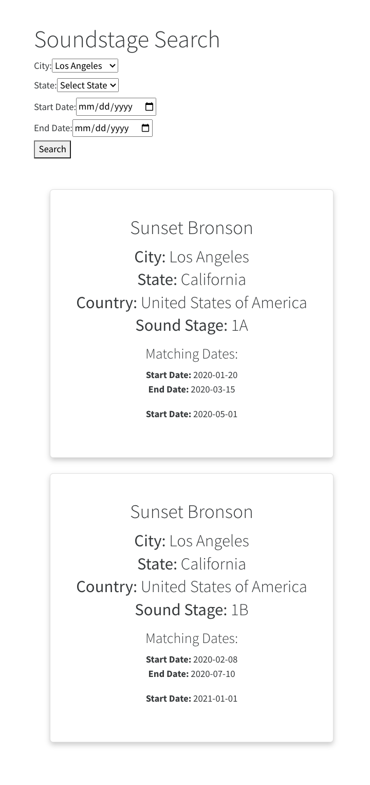

# SoundStage App

## Purpose of this Application
SoundStage Search is a web application that allows production executives to search for sound stages based on various criteria such as city, state, country, start date, and end date. It provides information about available sound stages for various studios.

## Technology Stack
- Node.js
- Express.js
- React

## Prerequisites
- Node.js v17.0.1
- npm 8.1.0

## Quick Start Instructions
1. Clone the repository to your local machine.
2. Navigate to the 'Backend' folder.
3. Install dependencies (npm install)
4. Start the backend server (npm start)
5. In a new terminal, navigate to the 'Frontend' folder.
6. Install dependencies (npm install)
7. Start the frontend application (npm start)
